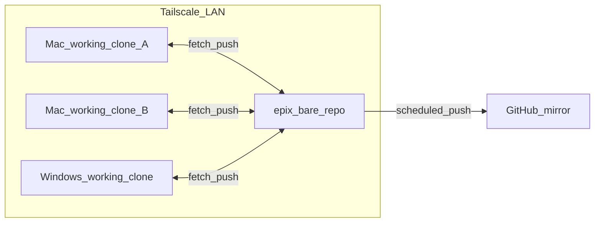

# 拓扑与角色

## 已定决策摘要

| 项目 | 决策 |
|------|------|
| 权威源 | **epix** Mac 上的 **bare** 仓库 |
| 从镜像 | **GitHub** `epix99-opus/GitNet`（HTTPS：<https://github.com/epix99-opus/GitNet>） |
| 同步方向 | 各端 ↔ epix；epix → GitHub 定时推送（**不在手册中推荐**从 GitHub 回写主线至 epix，除非灾备演练并记录在进程日志） |
| 多设备多 Agent 汇合点 | **epix bare** 为唯一写集成与默认 **push** 目标；GitHub 为从镜像（**非**日常多机合并枢纽）。规范演进与落地步骤见下文「规范状态」「多设备 × 多 Agent」 |
| 人类身份 | `user.name` / `user.email` 与 GitHub 账号一致 |
| Agent 提交作者名 | `{HOSTNAME}-{tool}`（例：`epix-cursor`），邮箱统一 `epix99@icloud.com` |

## 关系图

## 角色表

| 角色 | 说明 | Git 行为 |
|------|------|----------|
| epix_bare | 唯一权威对象库 | 接收各工作副本的 `push`；配置 `github` remote；由 launchd 执行 `git push` 到 GitHub |
| 其它 Mac 工作副本 | 编程主力节点（Claude Code / Codex / Cursor） | `origin`（或 `lan`）指向 epix bare；日常提交推送到 epix |
| Windows 工作副本 | 本机开发与人类 GUI | 同上；人类兜底身份见 [40-identity-and-includeIf.md](40-identity-and-includeIf.md) |
| GitHub | 灾备与公网可读 | 仅接收 epix 推送；人类日常不必在 SourceTree 中对 GitHub 做合并主线 |

## 工作副本与「设备级仓库」

- **每台机器**：一个或多个 **工作克隆**（project-level clone）即可；**不要**在 Windows 或非 epix Mac 上再建第二个 bare 作为业务权威。
- **设备级**：可用于 dotfiles、脚本目录；与 GitNet **业务** bare 分离。

## 默认远端命名建议

在工作克隆中：

- `origin` → epix bare（SSH，经 Tailscale）
- `github` →（可选）`git@github.com:epix99-opus/GitNet.git`，用于只读拉取或灾备演练，**不作为**日常默认 `push` 目标

---

## 规范状态与演进（多设备协作）

**自 2026-05-13 起**：下列「**集成与 push 权威在 epix bare**」条文作为本项目的 **目标规范** 落盘于此；与 [AGENTS.md](../AGENTS.md) 日常工作流一致。

- **若实作暂时偏离**（例如多端以 GitHub `main` 为事实汇合点、Issue 驱动对齐）：**允许**作为 bootstrap 或网络未就绪阶段的过渡，但须在 [90-process-log.md](90-process-log.md) 写明 **原因、预计结束条件、回到 bare 主线的验收步骤**。
- **「逐渐确认」**：当团队在实际拓扑上已连续按本节「最优实现」运行（各端 `origin` 指 bare、GitHub 仅镜像），由维护者在 `90-process-log.md` 记一条 **「10-topology 多设备规范已按实机确认」**，并将本段标题中的「目标」在后续修订中改为「已定」（一次小提交即可）。

---

## 多设备 × 多 Agent：集成与 push 权威在 epix bare 的最优实现

**一句化**：所有工作副本（各机、各编程 Agent）的 **日常 `fetch`/`pull`/`push` 汇合点** 为 **epix bare**；**GitHub** 仅通过 epix 上的定时 **`push github`** 成为只读镜像与灾备视图，**不作为**多机多 Agent 的默认合并枢纽。

### 1. Bare 仓库侧（epix）

与 [30-mac-epix-setup.md](30-mac-epix-setup.md) 配套，此处只列 **与多机协作相关的要点**：

1. **唯一业务 bare**：全团队一个路径（例如 `BARE=/srv/git/GitNet.git`），不在 Windows / 其它 Mac 上再建第二个「权威」裸仓。
2. **`github` remote 挂在 bare 上**；**仅** epix 本机服务账户（launchd / cron）执行 **`git -C "$BARE" push github <branch>`**；凭据与日志见 `30`。
3. **提交作者**：由各工作克隆在 `commit` 时写入（`{HOSTNAME}-{tool}` 等，见 [55-multi-node-multi-agent-git.md](55-multi-node-multi-agent-git.md)）；bare **不改写**作者字段。
4. **接收策略**（可选进阶）：若团队希望在 bare 上强制快进、或规定唯一可写分支名，在 bare 配置 hook / `receive.denyNonFastForwards` 等，并在 [90-process-log.md](90-process-log.md) 记录决策与例外账号。

### 2. 每台工作克隆（epix / glab / woot；人类或任一 Agent）

1. **`origin` → epix bare**（经 Tailscale SSH；主机别名与路径见 [45-ssh-tailscale-for-humans.md](45-ssh-tailscale-for-humans.md)、`30`、`46`）。
2. **`github` remote**（可选）：仅用于 **`git fetch`**、对照镜像、灾备 clone；**默认 `push` 不指向 GitHub**（除非 `90` 已登记例外）。
3. **开工节律**：`git fetch origin`，再 **`git merge origin/main`** 或 **`git pull --rebase origin main`**（按团队约定分支名），减少本地与 bare 分叉。
4. **收工节律**：本地自检通过后 **`git push origin main`**（或 **`git push origin <topic-branch>`** 再在 bare/第二克隆完成合并——若采用 feature 分支流，**汇合动作仍应对 bare 执行**，规则在 `90` 写清）。
5. **身份与目录**：与 push 目标正交；一律用 `includeIf` 命中正确片段，见 `55`、`40`。

### 3. 多 Agent 同时协作时的并发模型

| 情形 | 建议 |
|------|------|
| **不同机器、不同克隆** 向同一 bare push | **正常主路径**；后推送者若 **非快进** 则被 bare 拒绝 → 在其克隆内 **`git pull --rebase origin main`**（或 `fetch` + `rebase`）解决后再 `push`。 |
| **同一机器、多个目录**（如 `~/Dev/GitNet` 与 `~/Dev/CodexDev/GitNet`） | **推荐**；各目录绑定不同 `includeIf` 作者名；仍只向 **同一 `origin`（bare）** push；冲突同上。 |
| **同一克隆目录被两个工具同时写** | **不推荐**；易产生未提交混杂与锁竞争；应拆成 **两个克隆** 各绑一工具。 |
| **线性历史** | 若要求 `main` 快进线，团队统一 **rebase 后 push**；合并提交策略变更记入 `90`。 |

### 4. GitHub 的角色与「次优」路径

| 路径 | 定位 |
|------|------|
| **主路径** | bare 集成 → epix 定时 `push github` → 公网只读镜像 |
| **次优 / 过渡** | 多端直接对 GitHub `main` **fetch/pull/push**（例如 bare SSH 未通、bootstrap） |
| **迁回主路径** | 在 `90` 记迁移；各端将 `origin` 改回 bare 后，对比 **`git ls-remote origin`**（bare）与 **`git ls-remote github`** 直至一致，再停止对 GitHub 的直推习惯 |

[06-github-branch-protection.md](06-github-branch-protection.md) 用于避免「人类习惯直推 GitHub」与 **epix 镜像推送账号** 冲突；若对推送机器人使用规则例外，在 `90` 写明。

### 5. 感知层（不替代权威）

[92-github-auto-sync-collaboration.md](92-github-auto-sync-collaboration.md) 与 `handbook/scripts/gitnet-watch-github-sync.sh` 等：**只**解决「尽早知道远端有更新」与 **ff-only 拉取**，**不改变**「写集成只在 bare」的规范；与 OpenClaw / Hermes 等控制面关系见 `92` 文内对比。

---

## 修订记录

- 2026-05-13：摘要表增「多设备多 Agent 汇合点」；新增 **规范状态与演进**、**多设备 × 多 Agent：bare 最优实现**（与 `55` / `AGENTS` 交叉引用）；明确 GitHub 次优路径与 `90` 记录义务。
