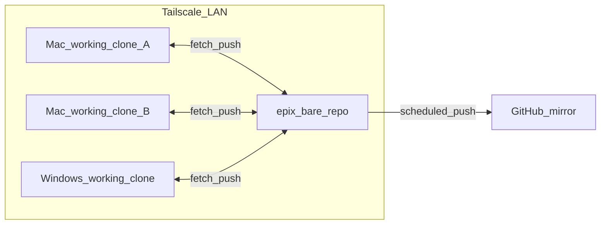

# 拓扑与角色

## 已定决策摘要

| 项目 | 决策 |
|------|------|
| 权威源 | **epix** Mac 上的 **bare** 仓库 |
| 从镜像 | **GitHub** `epix99-opus/GitNet`（HTTPS：<https://github.com/epix99-opus/GitNet>） |
| 同步方向 | 各端 ↔ epix；epix → GitHub 定时推送（**不在手册中推荐**从 GitHub 回写主线至 epix，除非灾备演练并记录在进程日志） |
| 人类身份 | `user.name` / `user.email` 与 GitHub 账号一致 |
| Agent 提交作者名 | `{HOSTNAME}-{tool}`（例：`epix-cursor`），邮箱统一 `epix99@icloud.com` |

## 关系图

## 角色表

| 角色 | 说明 | Git 行为 |
|------|------|----------|
| epix_bare | 唯一权威对象库 | 接收各工作副本的 `push`；配置 `github` remote；由 launchd 执行 `git push` 到 GitHub |
| 其它 Mac 工作副本 | 编程主力节点（Claude Code / Codex / Cursor） | `origin`（或 `lan`）指向 epix bare；日常提交推送到 epix |
| Windows 工作副本 | 本机开发与人类 GUI | 同上；人类兜底身份见 [40-identity-and-includeIf.md](40-identity-and-includeIf.md) |
| GitHub | 灾备与公网可读 | 仅接收 epix 推送；人类日常不必在 SourceTree 中对 GitHub 做合并主线 |

## 工作副本与「设备级仓库」

- **每台机器**：一个或多个 **工作克隆**（project-level clone）即可；**不要**在 Windows 或非 epix Mac 上再建第二个 bare 作为业务权威。
- **设备级**：可用于 dotfiles、脚本目录；与 GitNet **业务** bare 分离。

## 默认远端命名建议

在工作克隆中：

- `origin` → epix bare（SSH，经 Tailscale）
- `github` →（可选）`git@github.com:epix99-opus/GitNet.git`，用于只读拉取或灾备演练，**不作为**日常默认 `push` 目标
