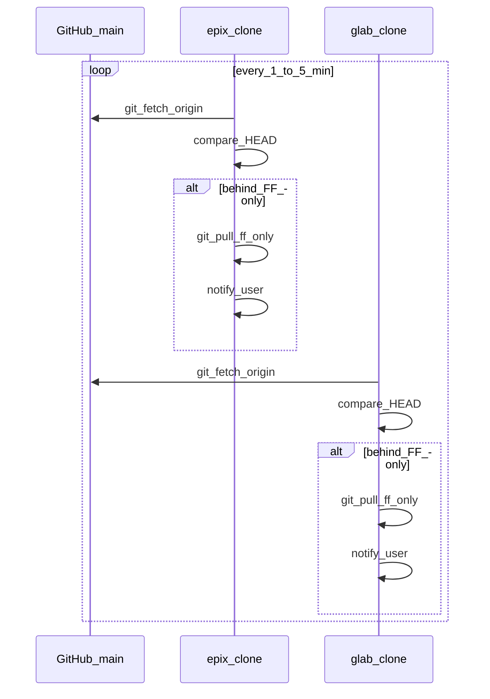

# GitHub 变更：近实时通知 + 双端自动同步（协作方案）**【备选 · Git 数据面】**

本文给出 **epix / glab** 在 GitHub 上出现**新提交**时，如何**尽快感知**并**自动拉取同步**的落地方案，以及如何把「任务完成」收口到可验收状态。

> **路线定位（备选）**：本方案是 **不依赖专用 Agent 编排栈** 的「**Git 对象层**」协作路径，适合作为 **基线/保险丝**。后续若由 **OpenClaw**、**Hermes Agent** 等项目承担「跨节点、多 Agent 控制面」，二者关系见下节 **不是简单二选一**。

## 与 OpenClaw / Hermes 的对比（控制面 vs 数据面）

| 维度 | 本方案（`92` + `launchd`/计划任务） | Hermes（Front Harness 等） | OpenClaw（你方将落地的项目） |
|------|--------------------------------------|------------------------------|-------------------------------|
| **主要解决的问题** | 各端工作副本与 GitHub **`main` 是否一致**；**ff-only** 安全拉取；本机通知 | **谁**在何种门禁下接任务；多模型/多从 Agent 编组；对 Codex 等 **实现工** 的契约与审查 | 你定义为编排/执行栈时的 **自动化协作**（具体以 OpenClaw 仓库定稿为准） |
| **是否理解「任务语义」** | 否（只看 ref 是否前进） | 是（任务契约、roster、gates） | 预期是（由项目设计决定） |
| **跨设备** | 是（每台机各自轮询） | 是（编排可跨会话/跨工具，落地仍要落到各机 Git） | 依架构（可与 Git 解耦或结合） |
| **与 Git 的关系** | **直接**操作 `git fetch/merge` | **间接**：Hermes 产出补丁/指令，人类或 Codex 写入 Git | 可接 Webhook、驱动 pull，或只做消息总线 |
| **单点故障** | GitHub 可达、本机 git 配置正确即可 | Hermes 进程/配置/模型可用性 | 依部署 |
| **运维成本** | 低（plist + shell） | 中～高（prompt、roster、运行时） | 依目标 |

### 二选一，还是并行互备？

- **不是互斥二选一**（除非团队刻意只保留一种「通知入口」以免重复打扰）：  
  - **数据面**：`92` 这类 **Git 轮询 + ff-only** 仍可长期保留，作为 **「无论 Agent 栈是否在跑，仓库不会长期分叉」** 的底线。  
  - **控制面**：**Hermes / OpenClaw** 负责 **任务分解、门禁、跨 Agent 移交、与人类的收口**；它们可以 **调用** 同一套 `git pull`（或由事件替代轮询），但 **不应** 被假设为 **唯一** 的 refs 同步机制——编排宕机时 Git 仍应对齐。

- **并行互备（推荐关系）**：  
  - **Hermes / OpenClaw** = 主编排 +（可选）更快的事件通道（Webhook、内部消息）。  
  - **`92`** = **冷备 / 基线**：编排未触发、或仅做了对话未落 git 时，轮询仍能发现远端新提交；**冲突**时仍以 Git 与 Issue 为准，不由编排器静默覆盖。

- **何时可以弱化 `92`**：当 OpenClaw/Hermes 能 **稳定** 提供「每 push 必达各节点且失败可观测」的交付，并把 **ff-only 策略** 嵌入其执行器时，可把轮询 **间隔拉大** 或 **只保留日志模式**，但建议 **保留** 最小脚本作灾备，除非有另一套等价监控（如集中 CI 镜像健康检查）。

## 外部参考（Hermes 工作区，不在 GitNet 内维护正文）

- 本地准备仓示例：`/Users/epix/Dev/Hermes/cama-hermes-front-harness/README.md`（Hermes 作 Codex 前置 harness 的定位说明）。GitNet 不复制其全文，仅作 **路线对照**。

## 0. 与拓扑（`10-topology`）的关系

- **定稿原则**仍见 [10-topology.md](10-topology.md)：业务权威在 **epix bare**；GitHub 为 **从镜像**。
- **本方案的定位**：适用于 **以 GitHub 为 `origin` 的协作交换面** 的阶段（例如 GitNet 本仓在 epix/glab 上互推 `main` 的实践）。若你已切回 **只向 epix bare `push`**，则把下文中的 **`origin` 改为 bare 远端**，对 **GitHub** 只做 **`git fetch github`** 轮询（只读），**不要**自动 `pull` 合并以免与「从镜像」策略冲突。

## 1. 「第一时间」的两种等级

| 等级 | 延迟量级 | 实现 | 适用 |
|------|----------|------|------|
| **A. 近实时** | 秒～数十秒 | **GitHub Webhook** → 本机/内网 HTTP 接收器 → 触发 `git pull` / 通知 | 愿意维护小服务、有固定入口（Tailscale Serve 等） |
| **B. 工程默认可行** | 1～5 分钟 | **轮询**：`git fetch` / `git ls-remote` 比较 `HEAD` 与 `origin/main` | 无公网入站、最小运维（**推荐默认**） |

Cursor **本身**不会在「远端刚 push」时自动弹窗；通知必须来自 **OS 层脚本** 或 **GitHub 通知渠道**。

## 2. 推荐架构（轮询 + 本机通知 + 安全合并）

- **自动同步**：仅 **`git pull --ff-only`**（或 `git merge --ff-only`）；若本地有提交会 **失败** → 不静默破坏，改走 Issue/人类处理 **rebase**。
- **通知**：epix 用 **osascript**（或 Shortcuts）；glab 用 **BurntToast** 模块或 `msg`（受限）或写日志 + 托盘工具。

## 3. epix（macOS）：launchd + 脚本

1. 将 [scripts/gitnet-watch-github-sync.sh](scripts/gitnet-watch-github-sync.sh) 复制到 `~/bin/` 或仓库外路径，**编辑**其中的 `GITNET_REPO`。
2. 用 [templates/com.gitnet.watch-github.plist](templates/com.gitnet.watch-github.plist) 复制到 `~/Library/LaunchAgents/`，把 `ProgramArguments` 里的脚本路径改成上一步绝对路径。
3. `launchctl load ~/Library/LaunchAgents/com.gitnet.watch-github.plist`
4. 验收：`launchctl list | grep gitnet`；故意在 GitHub 上产生一次提交后 5 分钟内本地 `git log -1` 应追上。

## 4. glab（Windows）：任务计划程序 + PowerShell

1. 复制 [templates/gitnet-watch-github-sync.ps1](templates/gitnet-watch-github-sync.ps1)，设置顶部的 **`$RepoRoot`**（如 `E:\DEV\GitNet`）。
2. **任务计划程序**：触发器「按重复计划间隔」**5 分钟**；操作「启动程序」`powershell.exe -NoProfile -ExecutionPolicy Bypass -File "C:\路径\gitnet-watch-github-sync.ps1"`；条件：仅 AC 供电时可取消勾选「仅交流电源」按你笔记本习惯。
3. 验收：在 GitHub 上合并一次无关小提交，观察脚本日志文件（脚本内 `$LogPath`）是否出现 `PULLED`。

## 5. 更「快」的升级路径（可选）

- **GitHub Webhook**（`push` 事件）→ **Tailscale Serve** 上仅 tailnet 可达的 **HTTPS 小服务**（几十行 Node/Go）→ 调用本机 `git -C ... pull --ff-only` + 通知。注意 **签名校验**（`X-Hub-Signature-256`）与 **secret** 放本机 plist/环境变量，**不入库**。
- **GitHub Actions**：在仓库内 workflow `on: push`，`curl` 到 ntfy / 企业微信 / Slack；**不**在 Action 里直接改 epix/glab 工作副本（无凭据到本机），只做**外发通知**，本机仍靠 §3/§4 拉取。

## 6. 「直到任务完成」的收口

| 机制 | 说明 |
|------|------|
| **Issue / Project** | 任务单与 PR 绑定；**关闭 Issue** = 协作回合结束；轮询脚本可检测「无 open 的 handoff issue」后只拉取不弹窗。 |
| **分支保护** | 见 [06-github-branch-protection.md](06-github-branch-protection.md)；避免 force-push 破坏自动 `ff-only`。 |
| **进程记录** | 启用自动同步当日，在 [90-process-log.md](90-process-log.md) 记一行：机器、间隔、`ff-only` 策略、日志路径。 |

## 7. 风险与禁止

- **禁止**在仓库或 plist 明文写入 **PAT / Webhook secret**；用 macOS Keychain、Windows Credential Manager 或仅 tailnet 内监听 + HMAC 校验。
- **禁止**自动 `pull` 非 **ff-only** 的默认策略，以免静默产生合并提交或覆盖本地未推送工作。

## 修订记录

- 2026-05-13：标注为 **备选（Git 数据面）**；增补与 **OpenClaw / Hermes** 的对比及 **并行互备** 建议。
- 2026-05-13：首版（epix/glab 双端轮询 + 可选 Webhook 升级路径）。
